# Custom 1090 MHz ADS-B Receiver

> Receive-only ADS-B hardware platform with a custom 1090 MHz RF front-end, pulse detector, digital decoder, and USB output.


<p align="center">
  
</p>

---

## Overview

The **Custom 1090 MHz ADS-B Receiver** is a dedicated receiver for aircraft Mode S and ADS-B transmissions at **1090 MHz**.

The final system is intended to provide a complete signal chain from antenna to PC without using a general-purpose SDR:

- RF filtering and low-noise amplification;
- envelope or logarithmic detection;
- comparator-based pulse conversion;
- ADS-B preamble and frame decoding;
- CRC verification;
- USB output compatible with `readsb` and `tar1090`.

> [!IMPORTANT]
> **V0.1 is an early schematic and simulation revision.**
>
> The power section, first RF filter, and first LNA stage are partially completed. The PCB, detector, decoder, firmware, and USB data interface are still under development.

---

## System Architecture

```mermaid
flowchart LR
    ANT[1090 MHz Antenna]
    ESD[RF ESD Protection]
    PRE[LC Preselector]
    LNA[PSA4-5043+ LNA]
    SAW[1090 MHz SAW Filter]
    DET[RF Detector]
    COMP[Comparator]
    DEC[MCU or FPGA Decoder]
    USB[USB Interface]
    PC[readsb / tar1090]

    ANT --> ESD
    ESD --> PRE
    PRE --> LNA
    LNA --> SAW
    SAW --> DET
    DET --> COMP
    COMP --> DEC
    DEC --> USB
    USB --> PC
```



```text
Antenna → SMA → RF ESD → LC preselector → LNA → SAW filter
        → RF detector → comparator → MCU/FPGA → USB → readsb/tar1090
```

---

## Hardware V0.1

The current revision includes:

- partial USB-C power-input section;
- resettable fuse and transient protection;
- preliminary 5 V and low-noise 3.3 V rails;
- SMA RF input;
- ultra-low-capacitance RF ESD protection;
- custom 1090 MHz LC preselector;
- PSA4-5043+ LNA with bias and decoupling;
- Monte Carlo simulation of the preselector.

### Schematics

| USB-C power section | RF front-end |
|---|---|
|  |  |

---

## Power Section

The receiver is powered from USB-C VBUS.

```text
USB-C VBUS
 └─ Resettable fuse
    └─ +5 V rail
       ├─ TVS protection
       ├─ Input decoupling
       ├─ Filtered LNA supply
       └─ TPS7A2033 LDO
          └─ +3.3 V rail
```

| Function | Component |
|---|---|
| USB-C connector | DX07S024JJ3R1300 |
| CC resistors | 5.1 kΩ |
| Resettable fuse | 1206L050YR |
| VBUS protection | ESD9B5.0ST5G |
| 3.3 V regulator | TPS7A2033PDBVR |
| RF supply ferrite | BLM18AG102SN1D |

Additional supply separation, protection, and test points will be added in later revisions.

---

## RF Front-End

```text
SMA
 └─ RCLAMP0502BATCT
    └─ 1090 MHz LC preselector
       └─ PSA4-5043+ LNA
          └─ 1090 MHz SAW filter
```

| Function | Component |
|---|---|
| RF connector | WR-SMA end-launch connector |
| RF ESD protection | RCLAMP0502BATCT |
| Preselector | Custom LC band-pass network |
| LNA | Mini-Circuits PSA4-5043+ |
| Bias choke | Coilcraft 0603CS-68NX |
| SAW filter | SF2321D |

---

## 1090 MHz LC Preselector

The first filter combines a high-pass and low-pass section to reduce out-of-band interference before the LNA.

```text
RF IN
 └─ 3.0 pF series
    ├─ 3.9 nH shunt
    └─ 3.0 pF series
       └─ 5.6 nH series
          ├─ 4.7 pF shunt
          └─ 5.6 nH series
             └─ RF OUT
```

### Components

| Reference | Value | Package |
|---|---:|---:|
| `C_HP_IN` | 3.0 pF | 0402 |
| `L_HP_SHUNT` | 3.9 nH | 0603 |
| `C_HP_OUT` | 3.0 pF | 0402 |
| `L_LP_IN` | 5.6 nH | 0603 |
| `C_LP_SHUNT` | 4.7 pF | 0402 |
| `L_LP_OUT` | 5.6 nH | 0603 |

### Schematics

| Ideal topology | Model with parasitics |
|---|---|
|  |  |

---

## Filter Simulation

The preselector was evaluated using a 50-run Monte Carlo AC sweep.

### Simulation Conditions

- frequency range: **100 MHz to 3 GHz**;
- source and load impedance: **50 Ω**;
- LC tolerance: approximately **5%**;
- parasitic tolerance: approximately **10–20%**;
- modeled ESR, ground-via inductance, ESD capacitance, and LNA input capacitance.

### Simulated Results

| Parameter | Result |
|---|---:|
| Target frequency | 1090 MHz |
| Best-case insertion loss | approximately −1.02 dB |
| Typical insertion loss | approximately −1.10 to −1.30 dB |
| Worst-case insertion loss | approximately −1.65 dB |
| Attenuation at 714 MHz | approximately −9.4 to −12.0 dB |
| Attenuation at 100 MHz | approximately −60 dB |

These values are simulation results and have not yet been confirmed on manufactured hardware.

| Full sweep | 1090 MHz region |
|---|---|
|  |  |

<p align="center">
  
</p>

---

## Low-Noise Amplifier

The first gain stage uses the **Mini-Circuits PSA4-5043+**.

```text
LC preselector
 └─ 100 pF DC block
    └─ PSA4-5043+
       ├─ 68 nH bias choke
       ├─ 100 pF bypass
       ├─ 1 nF bypass
       ├─ 100 nF bypass
       ├─ 1 µF local bulk capacitor
       └─ 100 pF output DC block
```

| Reference | Value | Purpose |
|---|---:|---|
| `C_LNA_IN` | 100 pF | Input DC blocking |
| `C_LNA_OUT` | 100 pF | Output DC blocking |
| `L_LNA_BIAS` | 68 nH | Bias feed and RF choke |
| `C_LNA_BYP_100pF` | 100 pF | RF decoupling |
| `C_LNA_BYP_1nF` | 1 nF | Intermediate-frequency decoupling |
| `C_LNA_BYP_100nF` | 100 nF | Low-frequency decoupling |
| `C_LNA_BYP_1uF` | 1 µF | Local bulk capacitance |

---

## PCB Requirements

The RF path will use controlled 50 Ω routing and a continuous ground plane.

Key layout requirements:

- shortest possible SMA-to-LNA path;
- ESD device directly beside the SMA connector;
- short shunt-component ground connections;
- multiple low-inductance ground vias;
- no RF stubs or unnecessary branches;
- physical separation between LNA input and output;
- decoupling capacitors placed directly beside the bias network;
- separation of RF, USB, MCU, and digital-clock routing;
- ground-via stitching around the RF section.

A four-layer stackup is preferred:

```text
Layer 1: RF components and controlled-impedance routing
Layer 2: Solid ground plane
Layer 3: Power distribution
Layer 4: Digital signals and USB
```

---

## Planned Stages

### RF Detection

The filtered RF signal will be converted into a baseband pulse envelope. Planned options include:

- Schottky envelope detector;
- custom successive-detection logarithmic amplifier;
- commercial logarithmic detector IC.

### Comparator

A high-speed comparator will convert the detector output into 3.3 V digital pulses using an adjustable threshold.

### Digital Decoder

The MCU or FPGA will perform:

- edge timestamping;
- ADS-B preamble detection;
- 56-bit and 112-bit frame decoding;
- CRC verification;
- USB output of valid messages.

### PC Interface

```text
Custom receiver → USB → readsb → tar1090
```

Debug output will initially use ASCII hexadecimal Mode S frames. A later revision may implement the Mode S Beast protocol.

---

## Development Roadmap

| Version | Main Goal |
|---|---|
| V0 | RTL-SDR reference system |
| **V0.1** | Partial power section, LC preselector, LNA, and simulations |
| V0.2 | Complete RF front-end and power architecture |
| V0.3 | Detector prototypes |
| V0.4 | Comparator and adjustable threshold |
| V0.5 | Manufactured RF prototype PCB |
| V0.6 | External MCU or FPGA decoder |
| V0.7 | USB and `readsb` integration |
| V1.0 | Complete integrated receiver |

---

## Current Status

### Completed

- receiver architecture defined;
- main RF components selected;
- USB-C power section started;
- input protection added;
- LC preselector designed;
- realistic parasitics modeled;
- Monte Carlo simulation completed;
- PSA4-5043+ LNA stage designed.

### In Progress

- complete power architecture;
- SAW filter integration;
- detector selection and simulation;
- comparator design;
- RF test points;
- PCB stackup and impedance calculation.

### Not Yet Implemented

- PCB layout and manufactured hardware;
- physical RF measurements;
- RF detector and comparator;
- embedded ADS-B decoder;
- USB data communication;
- `readsb` and `tar1090` integration.

---

## Validation Plan

| Test | Purpose |
|---|---|
| Power test | Verify voltage, noise, and current |
| Filter measurement | Measure insertion loss and rejection |
| LNA test | Verify gain and stability |
| Detector test | Measure output versus RF input level |
| Pulse test | Verify timing and pulse distortion |
| Decoder test | Decode known ADS-B messages |
| Live test | Receive real aircraft transmissions |
| RTL-SDR comparison | Compare coverage and message rate |
| Long-duration test | Verify thermal and USB stability |

---

## Repository Structure

```text
custom-1090mhz-adsb-receiver/
├─ README.md
├─ Photos/
│  └─ VER_0.1/
├─ Hardware/
│  └─ Altium/
├─ Documentation/
├─ Firmware/
└─ Tests/
```

---

## License

No open-source license has currently been selected.

Until a `LICENSE` file is added, the project should be treated as **all rights reserved**.

---

## Author

**Maksym Pleshyvtsev**  
Electrical Engineering Student  
Brno University of Technology — FEKT
