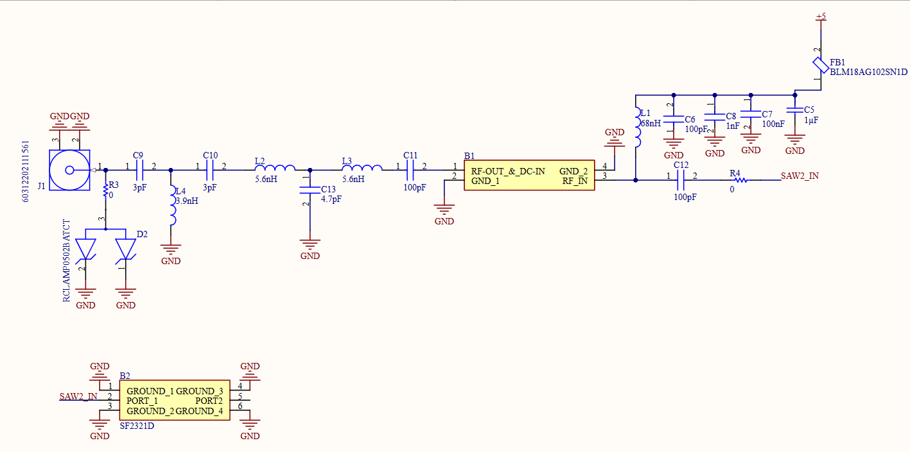
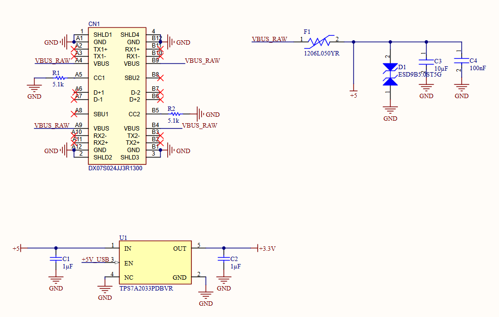
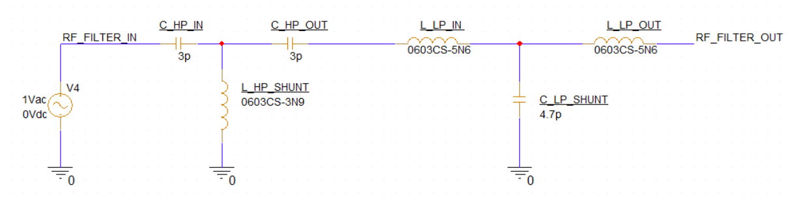
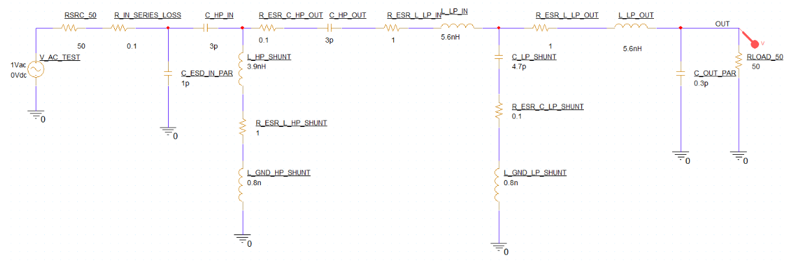
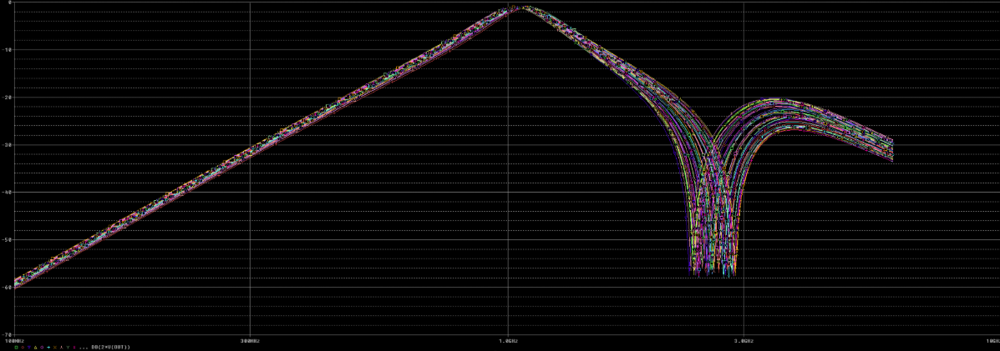
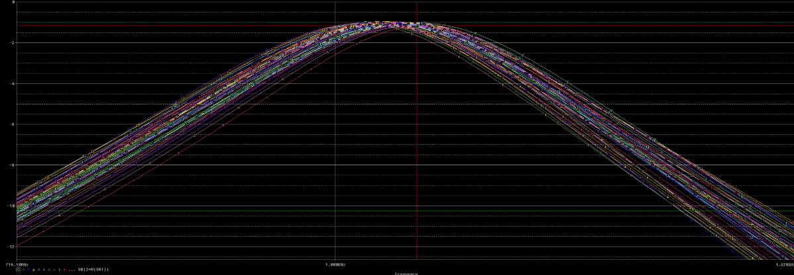
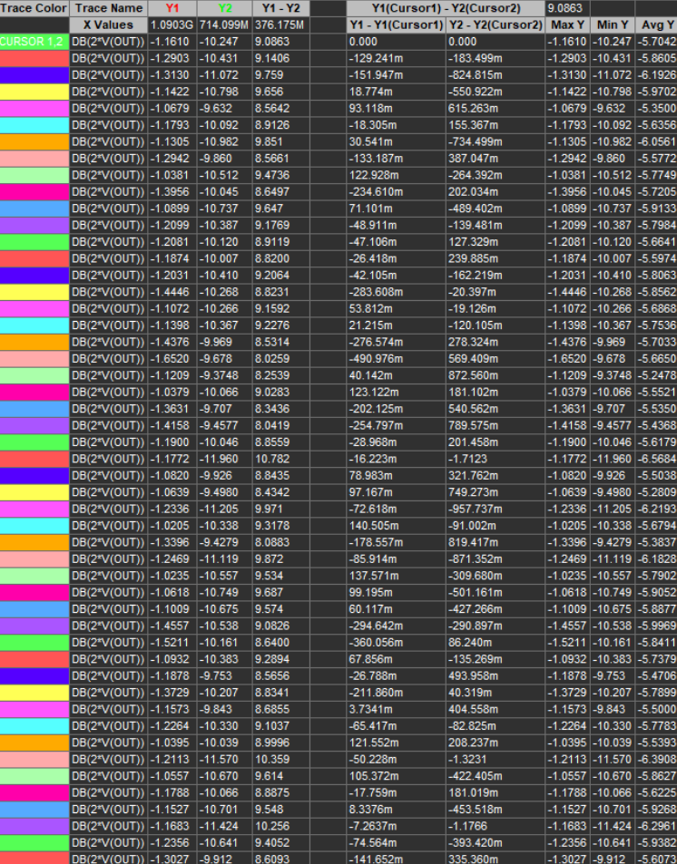

# Custom 1090 MHz ADS-B Receiver

> Dedicated receive-only ADS-B hardware platform with a custom 1090 MHz RF front-end, pulse-detection architecture, digital decoder, and USB output.


<p align="center">
  
</p>

---

## Overview

The **Custom 1090 MHz ADS-B Receiver** is a purpose-built electronic receiver designed to capture and process aircraft Mode S and ADS-B transmissions on **1090 MHz**.

The long-term objective is to create a complete hardware chain between a commercial 1090 MHz antenna and a host computer without relying on a general-purpose SDR receiver.

The planned system will:

- receive weak 1090 MHz aircraft transmissions;
- reject strong out-of-band interference;
- amplify the desired RF signal;
- convert RF pulse envelopes into digital logic pulses;
- detect ADS-B preambles and decode Mode S frames;
- verify received messages using CRC;
- transmit valid frames to a computer through USB;
- integrate with `readsb` and `tar1090` for live aircraft visualization.

> [!IMPORTANT]
> **Hardware V0.1 is an early schematic and simulation milestone.**
>
> The complete receiver, PCB layout, detector, digital decoder, and USB data interface have not yet been implemented.

---

## Project Scope

The project combines several areas of electrical engineering:

- RF front-end design;
- 1090 MHz filtering;
- low-noise amplification;
- controlled-impedance PCB design;
- RF envelope and logarithmic detection;
- high-speed analog comparison;
- MCU or FPGA-based pulse decoding;
- USB communication;
- embedded firmware;
- RF measurement and validation.

The final receiver is intended to operate as a dedicated passive ADS-B monitoring device.

### What the Project Is

- a passive receive-only ADS-B receiver;
- an educational RF and mixed-signal hardware platform;
- a dedicated alternative to an SDR for 1090 MHz ADS-B reception;
- a complete RF-to-USB engineering project.

### What the Project Is Not

- an active radar;
- an ADS-B transmitter;
- an aircraft communication device;
- a system for generating, modifying, or spoofing aviation messages.

---

## System Architecture


### Planned Signal Chain

```text
1090 MHz antenna
 └─ SMA input
    └─ Ultra-low-capacitance ESD protection
       └─ Custom LC preselector
          └─ PSA4-5043+ low-noise amplifier
             └─ 1090 MHz SAW filter
                └─ RF envelope / logarithmic detector
                   └─ High-speed comparator
                      └─ MCU or FPGA decoder
                         └─ USB output
                            └─ readsb
                               └─ tar1090
```

---

## Hardware V0.1

Hardware V0.1 represents the first development stage of the receiver.

The current revision contains:

- a partially completed USB-C power-input architecture;
- input overcurrent and transient protection;
- preliminary 5 V and low-noise 3.3 V power rails;
- an SMA RF input;
- ultra-low-capacitance RF ESD protection;
- a custom 1090 MHz LC preselector;
- a PSA4-5043+ LNA stage;
- LNA biasing and multi-frequency power decoupling;
- a prepared connection toward the next RF filtering stage;
- Monte Carlo simulation of the LC preselector.

The detector, comparator, decoder, USB data interface, PCB layout, and firmware remain under development.

---

## V0.1 Schematic

| USB-C power section | RF front-end |
|---|---|
|  |  |

---

## Power Architecture

The receiver is powered through a USB-C connector.

The V0.1 power-input section currently contains:

- USB-C VBUS input;
- two 5.1 kΩ USB Type-C configuration resistors;
- resettable input fuse;
- transient-voltage suppression;
- 10 µF bulk input capacitance;
- 100 nF high-frequency decoupling;
- protected 5 V rail;
- TPS7A2033 low-noise 3.3 V regulator;
- dedicated filtering for the RF amplifier supply.

```text
USB-C VBUS
 └─ Resettable fuse
    └─ +5 V rail
       ├─ TVS protection
       ├─ Input decoupling
       ├─ Filtered LNA supply
       └─ TPS7A2033 LDO
          └─ +3.3 V rail
```

### Main Power Components

| Function | Component | Purpose |
|---|---|---|
| USB-C connector | DX07S024JJ3R1300 | Power input and future USB communication |
| USB-C CC resistors | 5.1 kΩ | USB-C sink configuration |
| Input fuse | Littelfuse 1206L050YR | Resettable input overcurrent protection |
| VBUS protection | ESD9B5.0ST5G | Suppression of input transients |
| 3.3 V regulator | TPS7A2033PDBVR | Low-noise 3.3 V supply |
| RF supply ferrite | BLM18AG102SN1D | Isolation of RF and power-supply noise |

> [!NOTE]
> The power architecture is only partially completed in V0.1. Additional supply separation, test points, protection, and digital power sections will be added in future revisions.

---

## RF Input

The RF input uses a 50 Ω SMA interface followed by an RF protection device and the custom LC preselector.

```text
SMA
 └─ RCLAMP0502BATCT
    └─ 1090 MHz LC preselector
       └─ PSA4-5043+ LNA
```

### RF Input Components

| Function | Component |
|---|---|
| RF connector | WR-SMA end-launch connector |
| RF ESD protection | RCLAMP0502BATCT |
| Preselector | Custom LC high-pass / low-pass network |
| Low-noise amplifier | Mini-Circuits PSA4-5043+ |
| LNA supply filter | BLM18AG102SN1D |
| LNA bias choke | Coilcraft 0603CS-68NX |

The ESD protection device must be placed directly next to the SMA connector to minimize the unprotected RF path.

---

## 1090 MHz LC Preselector

The first RF filter is a custom lumped-element preselector.

Its main purpose is to reduce strong out-of-band interference before the LNA while maintaining low insertion loss around the ADS-B frequency.

The filter combines:

- a high-pass section for rejection of lower-frequency signals;
- a low-pass section for suppression of higher-frequency interference;
- realistic PCB and component parasitics included in simulation.

### Filter Topology

```text
RF IN
 └─ 3.0 pF series capacitor
    ├─ 3.9 nH shunt inductor
    └─ 3.0 pF series capacitor
       └─ 5.6 nH series inductor
          ├─ 4.7 pF shunt capacitor
          └─ 5.6 nH series inductor
             └─ RF OUT
```

### Filter Components

| Reference | Value | Package | Selected Component |
|---|---:|---:|---|
| `C_HP_IN` | 3.0 pF | 0402 | Murata GJM1555C1H3R0CB01D |
| `L_HP_SHUNT` | 3.9 nH | 0603 | Coilcraft 0603CS-3N9XJRW |
| `C_HP_OUT` | 3.0 pF | 0402 | Murata GJM1555C1H3R0CB01D |
| `L_LP_IN` | 5.6 nH | 0603 | Coilcraft 0603CS-5N6XJRW |
| `C_LP_SHUNT` | 4.7 pF | 0402 | Murata GJM1555C1H4R7CB01D |
| `L_LP_OUT` | 5.6 nH | 0603 | Coilcraft 0603CS-5N6XJRW |

### Filter Schematics

| Ideal LC topology | Model with physical parasitics |
|---|---|
|  |  |

---

## Filter Simulation

The preselector was evaluated using an AC sweep and Monte Carlo analysis.

### Simulation Setup

- frequency sweep: **100 MHz to 3 GHz**;
- source impedance: **50 Ω**;
- load impedance: **50 Ω**;
- Monte Carlo runs: **50**;
- LC component tolerance: approximately **5%**;
- parasitic tolerance: approximately **10–20%**;
- modeled ESD and input capacitance;
- modeled capacitor and inductor ESR;
- modeled ground-via inductance;
- modeled LNA input capacitance.

### Modeled Parasitics

| Parameter | Model Value | Physical Meaning |
|---|---:|---|
| Input parasitic capacitance | 1.0 pF | ESD diode, SMA pad, and input routing |
| Output parasitic capacitance | 0.3 pF | Approximate LNA input loading |
| Shunt ground inductance | 0.8 nH | Pads, vias, and ground connection |
| Inductor ESR | 1.0 Ω | Finite inductor Q and RF losses |
| Capacitor ESR | 0.1 Ω | Capacitor RF losses |
| Input trace resistance | 0.1 Ω | Approximate physical routing loss |

### Simulated Performance

| Parameter | Simulated Result |
|---|---:|
| Target frequency | 1090 MHz |
| Best-case insertion loss | approximately −1.02 dB |
| Typical insertion loss | approximately −1.10 to −1.30 dB |
| Worst-case insertion loss | approximately −1.65 dB |
| Attenuation at 714 MHz | approximately −9.4 to −12.0 dB |
| Attenuation at 100 MHz | approximately −60 dB |
| High-frequency response | Strong attenuation notch around 2.4–3.0 GHz |

These results are based entirely on circuit simulation. They have not yet been confirmed through measurements on manufactured hardware.

### Monte Carlo Results

| Full frequency sweep | 1090 MHz region |
|---|---|
|  |  |

<p align="center">
  
</p>

---

## Low-Noise Amplifier

The first amplification stage is based on the **Mini-Circuits PSA4-5043+** E-PHEMT MMIC amplifier.

The LNA is positioned directly after the custom LC preselector.

```text
LC preselector
 └─ 100 pF input DC-blocking capacitor
    └─ PSA4-5043+ LNA
       ├─ 68 nH bias choke
       ├─ 100 pF bypass capacitor
       ├─ 1 nF bypass capacitor
       ├─ 100 nF bypass capacitor
       ├─ 1 µF bypass capacitor
       └─ 100 pF output DC-blocking capacitor
```

### LNA Components

| Reference | Value | Package | Purpose |
|---|---:|---:|---|
| LNA | PSA4-5043+ | SOT-343 | Low-noise RF amplification |
| `C_LNA_IN` | 100 pF | 0402 | Input DC blocking |
| `C_LNA_OUT` | 100 pF | 0402 | Output DC blocking |
| `L_LNA_BIAS` | 68 nH | 0603 | RF choke and DC bias feed |
| `C_LNA_BYP_100pF` | 100 pF | 0402 | RF-frequency decoupling |
| `C_LNA_BYP_1nF` | 1 nF | 0402 | Intermediate-frequency decoupling |
| `C_LNA_BYP_100nF` | 100 nF | 0402 | Low-frequency decoupling |
| `C_LNA_BYP_1uF` | 1 µF | 0603 | Local bulk capacitance |
| `FB_LNA_SUPPLY` | BLM18AG102SN1D | 0603 | LNA supply isolation |

The LNA supply is injected through its RF output pin using the 68 nH bias choke.

The cascaded bypass network is intended to suppress power-supply noise across a wide frequency range.

---

## RF PCB Design Requirements

The RF section will require careful PCB implementation because ordinary traces and ground connections become significant circuit elements at 1090 MHz.

### Critical Layout Rules

- use controlled 50 Ω RF traces;
- keep the SMA-to-LNA signal chain as short as possible;
- maintain a continuous ground plane beneath the RF path;
- avoid branches and unused RF stubs;
- place the RF ESD device immediately next to the SMA connector;
- place shunt filter components directly next to ground vias;
- use multiple low-inductance ground vias;
- connect LNA ground pins directly to the ground plane;
- avoid thermal reliefs on RF grounding pads;
- physically separate LNA input and output routing;
- place the smallest LNA bypass capacitor closest to the bias choke;
- isolate the RF section from MCU, USB, and digital clock routing;
- use ground-via stitching around the RF signal path.

A four-layer PCB is currently preferred for the final integrated receiver:

```text
Layer 1: RF components and controlled-impedance routing
Layer 2: Solid uninterrupted ground plane
Layer 3: Power distribution
Layer 4: Digital signals, USB, and low-speed control
```

---

## Planned RF Detection Stage

After the LNA and SAW filtering stages, the 1090 MHz RF signal must be converted into a lower-frequency analog envelope.

Several architectures are planned for evaluation:

1. simple Schottky envelope detector;
2. custom successive-detection logarithmic amplifier;
3. commercial RF logarithmic detector IC.

The outputs of these architectures can be compared according to:

- sensitivity;
- dynamic range;
- pulse rise and fall time;
- timing distortion;
- detector output voltage;
- noise level;
- comparator false-trigger rate;
- PCB area;
- current consumption;
- implementation complexity.

The preferred experimental direction is a custom four-stage successive-detection logarithmic amplifier with a commercial detector path retained as a reference.

---

## Planned Comparator Stage

A high-speed comparator will convert the analog detector output into clean 3.3 V logic pulses.

```text
Detector output
 └─ Comparator input
    ├─ Adjustable threshold
    └─ 3.3 V digital pulse output
```

The threshold will initially be manually adjustable.

Future revisions may support an MCU-controlled threshold generated through PWM filtering or a DAC.

Important comparator requirements include:

- 3.3 V operation;
- low propagation delay;
- low input offset;
- detector-compatible input common-mode range;
- clean logic-level output;
- accessible threshold and output test points.

---

## Planned Digital Decoder

The digital decoder will analyze the comparator output and process the ADS-B pulse timing.

Planned responsibilities include:

- edge timestamping;
- ADS-B preamble detection;
- pulse-position bit decoding;
- recognition of 56-bit and 112-bit Mode S frames;
- CRC verification;
- rejection of corrupted frames;
- output of valid messages over USB.

The first prototype may use an external MCU development board.

An FPGA-based timing front-end remains a possible later improvement.

---

## PC Software Architecture

The planned host-side data path is:

```text
Custom receiver
 └─ USB serial or binary stream
    └─ readsb
       └─ aircraft.json
          └─ tar1090
             └─ Live aircraft map
```

Two output modes are planned:

### Debug Mode

Decoded frames are transmitted as ASCII hexadecimal strings.

Example:

```text
8D40621D58C382D690C8AC2863A7
```

### readsb-Compatible Mode

The receiver outputs messages using a format compatible with `readsb`, potentially through the Mode S Beast protocol.

---

## Development Roadmap

| Version | Development Stage | Main Deliverable |
|---|---|---|
| V0 | RTL-SDR baseline | Working antenna, `readsb`, and `tar1090` reference system |
| **V0.1** | Initial schematic development | Partial power supply, LC preselector, LNA, and filter simulation |
| V0.2 | Complete RF front-end | Final filtering, RF detector interfaces, and complete power architecture |
| V0.3 | Detector prototypes | Envelope and logarithmic detector simulations |
| V0.4 | Comparator stage | Adjustable threshold and digital pulse output |
| V0.5 | RF prototype PCB | Manufactured and measured RF front-end |
| V0.6 | External decoder | MCU or FPGA development-board decoder |
| V0.7 | USB and readsb integration | Valid ADS-B messages delivered to the PC |
| V1.0 | Integrated receiver PCB | Complete RF, detector, decoder, and USB receiver |

---

## Current Project Status

### Completed in V0.1

- overall receiver architecture defined;
- principal RF components selected;
- USB-C power-input section started;
- resettable fuse and VBUS protection added;
- low-noise 3.3 V regulator selected and added;
- SMA RF input added;
- RF ESD protection selected;
- custom 1090 MHz LC preselector designed;
- realistic filter parasitics modeled;
- Monte Carlo simulation completed;
- PSA4-5043+ LNA stage designed;
- LNA bias choke and decoupling network added;
- schematic documentation images exported.

### In Progress

- completion of the full power architecture;
- final RF power-rail separation;
- downstream SAW filter verification;
- RF detector architecture;
- successive-detection log-amplifier simulation;
- detector comparison path;
- comparator and threshold circuit;
- RF test-point architecture;
- PCB stackup and controlled-impedance calculations.

### Not Yet Implemented

- complete PCB layout;
- manufactured hardware;
- physical RF measurements;
- RF detector;
- comparator;
- embedded ADS-B decoder;
- USB data communication;
- `readsb` integration;
- `tar1090` operation from the custom receiver.

---

## Testing and Validation Plan

Each stage will be validated separately before integration.

| Test | Purpose |
|---|---|
| Power-rail test | Verify 5 V and 3.3 V voltage, noise, and current consumption |
| Filter S-parameter test | Measure insertion loss and rejection around 1090 MHz |
| LNA gain test | Verify RF gain, stability, and noise-floor behaviour |
| Detector sweep | Measure detector output versus RF input power |
| Pulse-response test | Verify ADS-B pulse rise time, fall time, and distortion |
| Comparator test | Check threshold sensitivity and false triggering |
| Decoder test | Decode known and recorded ADS-B pulse sequences |
| Live antenna test | Receive real aircraft transmissions |
| Baseline comparison | Compare results against an RTL-SDR reference receiver |
| Long-duration test | Verify thermal and USB stability |

Important final performance metrics include:

- valid ADS-B messages per second;
- number of visible aircraft;
- maximum reception distance;
- CRC failure rate;
- receiver current consumption;
- RF gain;
- detector sensitivity;
- continuous operating stability.

---

## Repository Structure

```text
custom-1090mhz-adsb-receiver/
├─ README.md
├─ Photos/
│  └─ VER_0.1/
│     ├─ 01_POWER_ver0.1.png
│     ├─ 02_RF_FRONT_END_ver0.1.png
│     ├─ filtr_ver0.1.png
│     ├─ filtr_real_ver0.1.png
│     ├─ SIM1_ver0.1.png
│     ├─ SIM2_ver0.1.png
│     └─ values_ver0.1.png
├─ Hardware/
│  └─ Altium/
├─ Documentation/
├─ Firmware/
```

Hardware, simulation, and manufacturing files should be separated by revision as the project develops.

---

## Future Improvements

Possible future extensions include:

- adaptive comparator threshold control;
- FPGA-based preamble detection and bit slicing;
- integrated 1090 MHz bias tee;
- mast-mounted external LNA support;
- RF shielding over the receiver front-end;
- additional RF test connectors;
- USB-C data communication;
- automatic gain or sensitivity control;
- custom enclosure;
- long-term aircraft statistics and logging;
- parallel 978 MHz UAT receiver path.

---

## License

No open-source license has currently been selected.

Until a `LICENSE` file is added, the project should be treated as **all rights reserved**.

---

## Author

**Maksym Pleshyvtsev**  
Electrical Engineering Student  
Brno University of Technology — FEKT
