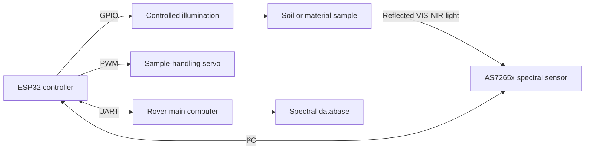

# AS7265x Soil Analysis Module

> Competition-ready multispectral soil-analysis payload developed for the **Brno Mars Rover / Freya** science subsystem.


<p align="center">
  
</p>

---

## Overview

The **AS7265x Soil Analysis Module** is a rover-mounted scientific payload designed for multispectral analysis of soils, minerals, salts, clays, and organic reference materials.

The system uses the **AS7265x 18-channel VIS-NIR spectral sensor** to measure reflected light between approximately **410 nm and 940 nm**. An ESP32 controls the sensor, sample-handling servo, illumination, calibration sequence, and communication with the rover main computer.

The project combines:

- custom PCB design;
- protected power distribution;
- embedded control;
- multispectral data acquisition;
- calibration and measurement methodology;
- spectral database development;
- mechanical and rover-system integration.

The current PCB V1.0 provides the core functionality required for the competition while remaining open to future sensor and hardware improvements.

---

## Engineering Scope

The project was developed from system concept to an assembled and operational hardware platform.

The engineering work includes:

- defining the overall science-module architecture;
- selecting the sensor, controller, actuator, connectors, and protection components;
- designing the complete schematic in Altium Designer;
- creating a custom two-layer carrier PCB;
- designing protected 5 V and 3.3 V power branches;
- integrating I²C, UART, PWM, and illumination interfaces;
- preparing the component BOM and purchasing documentation;
- assembling and debugging the first PCB revision;
- developing ESP32 firmware for sensor and servo control;
- creating a structured spectral material database;
- defining calibration and sample-preparation procedures;
- preparing the system for mechanical integration with the Freya rover.

---

## System Operation

The module performs the following measurement sequence:

1. The sample is placed inside the analysis area.
2. The servo moves the sample mechanism into the measurement position.
3. Controlled illumination is activated.
4. The AS7265x records 18 spectral channels.
5. The measurement is corrected using dark and white references.
6. The processed spectrum is stored or transmitted to the rover computer.
7. The result can be compared with the spectral material database.



---

## Main Features

- 18-channel spectral acquisition from approximately 410 nm to 940 nm;
- ESP32-based sensor and actuator control;
- USB programming and debugging through the ESP32 development board;
- protected 5 V rover power input;
- filtered 3.3 V sensor supply;
- separate protected servo power branch;
- UART connection to the rover main computer;
- MOSFET-controlled external illumination;
- JST-XH connectors for external modules;
- 1206 passive components for easier manual assembly;
- support for dark-reference and white-reference calibration;
- labelled spectral database for material comparison.

---

## PCB V1.0

PCB V1.0 is the first fully assembled and operational competition version of the carrier board. It implements the core functionality required for the current Mars Rover science task, while leaving room for additional sensors and hardware improvements in future revisions.

The PCB is a two-layer carrier and interface board. The ESP32 development board, AS7265x sensor, servo, and illumination source are connected as external modules.

### PCB Design Characteristics

- two-layer PCB;
- bottom ground plane;
- top-side signal and power routing;
- protected XT30 5 V input;
- reverse-polarity protection;
- resettable main and servo fuses;
- separate sensor and servo power branches;
- local bulk and ceramic decoupling;
- external JST-XH interfaces;
- ESP32 mounted on female headers;
- four mechanical mounting holes;
- 1206 passive components where practical.

### V1.0 Hardware Images

| Power and protection | ESP32 section |
|---|---|
|  |  |

| External connections | PCB layout |
|---|---|
|  |  |

| PCB 3D model | Assembled PCB |
|---|---|
|  |  |

---

## Hardware Architecture

### Main Components

| Function | Component | Purpose |
|---|---|---|
| Controller | ESP-WROOM-32 development board with CP2102 | Sensor control, servo control, UART communication and data processing |
| Spectral sensor | AS7265x multispectral triad | 18-channel VIS-NIR measurement |
| Servo | Hitec HS-5645MG | Sample-mechanism positioning |
| Sensor regulator | TLV75533PDBVR | Protected 3.3 V sensor supply |
| Reverse-polarity protection | AO4407A | Protects the board from incorrect input polarity |
| Main and servo fuses | Littelfuse 2920L300/15DR | Resettable overcurrent protection |
| Input and servo TVS | SMBJ5.0A-13-F | Suppression of voltage transients |
| Sensor filtering | BLM31PG121SN1L | High-frequency noise filtering |
| Illumination switch | AO3400A | Low-side control of external illumination |
| Main power connector | XT30PB | Rover 5 V input |
| Signal connectors | JST-XH | Sensor, UART, servo and auxiliary connections |

---

## Power Architecture

The module is supplied by the rover's regulated **5 V power rail**.

```text
XT30 5 V input
 └─ Main resettable fuse
    └─ Reverse-polarity MOSFET
       └─ +5V_PROTECTED
          ├─ ESP32 development board
          ├─ Servo branch
          │  ├─ Resettable fuse
          │  ├─ TVS protection
          │  └─ Local bulk capacitance
          ├─ TLV75533 3.3 V sensor regulator
          │  └─ Ferrite bead
          │     └─ +3V3_SENSOR
          └─ Illumination branch
```

The input stage includes:

- resettable overcurrent protection;
- reverse-polarity protection;
- transient-voltage suppression;
- 1000 µF bulk capacitance;
- ceramic decoupling capacitors.

The servo branch is separated from the sensor supply to reduce the effect of servo current transients on spectral measurements.

> [!CAUTION]
> PCB V1.0 is designed for a regulated **5 V input**. It must not be connected directly to a higher-voltage battery rail.

---

## External Interfaces

### AS7265x Sensor

The external AS7265x module is connected through a 6-pin JST-XH interface.

| Signal | ESP32 connection | Description |
|---|---|---|
| `+3V3_SENSOR` | — | Filtered 3.3 V sensor supply |
| `GND` | GND | Common ground |
| `ESP32_SDA` | GPIO21 | I²C data |
| `ESP32_SCL` | GPIO22 | I²C clock |
| `AS7265X_INT` | Configurable GPIO | Sensor interrupt |
| `AS7265X_RST` | Configurable GPIO | Sensor reset |

The I²C lines include series resistors and optional pull-up and ESD-protection positions.

### Rover UART

Communication with the rover main computer is provided through UART2.

| Signal | ESP32 pin | Description |
|---|---|---|
| `UART2_TX` | GPIO17 | ESP32 transmit |
| `UART2_RX` | GPIO16 | ESP32 receive |
| `3V3_REF` | 3.3 V | Logic-level reference |
| `GND` | GND | Common ground |

The interface uses **3.3 V UART logic**.

### Servo

| Signal | Description |
|---|---|
| `+5V_SERVO` | Protected servo power |
| `GND` | Servo ground |
| `SERVO_PWM` | ESP32 PWM control |

The servo connector has dedicated power protection and local bulk capacitance.

---

## Spectral Measurement

The AS7265x provides 18 nominal spectral channels:

| Channel | Wavelength | Channel | Wavelength | Channel | Wavelength |
|---|---:|---|---:|---|---:|
| A | 410 nm | G | 560 nm | R | 730 nm |
| B | 435 nm | H | 585 nm | S | 760 nm |
| C | 460 nm | I | 610 nm | T | 810 nm |
| D | 485 nm | J | 645 nm | U | 860 nm |
| E | 510 nm | K | 680 nm | V | 900 nm |
| F | 535 nm | L | 705 nm | W | 940 nm |

The module is designed for **comparative spectral analysis** rather than definitive laboratory chemical identification.

Measurement quality depends on:

- sensor-to-sample distance;
- sample fill level;
- illumination intensity and angle;
- integration time and sensor gain;
- grain size;
- moisture;
- surface geometry;
- sample compaction;
- ambient light;
- contamination from previous samples.

---

## Calibration

Each measurement can be corrected using dark and white references.

```text
Reflectance[i] =
    (Sample[i] - Dark[i])
    /
    (White[i] - Dark[i])
```

A typical measurement sequence is:

1. record a dark reference;
2. record a white reference;
3. place and level the sample;
4. acquire several repeated scans;
5. calculate the normalized channel values;
6. store the spectrum together with measurement metadata.

PTFE is planned as the primary stable white-reference material.

---

## Firmware

The current system uses MicroPython on the ESP32.

Firmware responsibilities include:

- AS7265x initialization;
- I²C communication;
- 18-channel spectral acquisition;
- servo positioning;
- illumination control;
- dark and white calibration;
- UART communication;
- automated measurement sequencing;
- transfer of results to the rover computer.

Example command used during development:

```powershell
mpremote connect COM3 exec "import auto_main"
```

Replace `COM3` with the active ESP32 serial port.

A recommended firmware structure is:

```text
Firmware/
├─ boot.py
├─ main.py
├─ auto_main.py
├─ as7265x.py
├─ servo_control.py
├─ illumination.py
├─ calibration.py
├─ uart_protocol.py
└─ config.py
```

---

## Spectral Material Database

A dedicated database is being developed for calibration, comparison, and future classification algorithms.

The database contains:

### Martian and Geological Analogs

- iron oxides;
- iron sulfate;
- magnesium sulfate;
- sulfur;
- gypsum;
- calcium and magnesium carbonates;
- kaolin;
- bentonite and smectite clays;
- quartz sand;
- dolomite;
- terrestrial soils and mineral mixtures.

### Optical References

- PTFE white reference;
- magnesium oxide;
- calcium carbonate;
- activated carbon;
- black iron oxide.

### Organic and Contamination References

- citric acid;
- ascorbic acid;
- tartaric acid;
- cornstarch;
- peat;
- PET plastic;
- wood ash;
- rover-related contamination materials.

A recommended database record contains:

```csv
timestamp,
sample_id,
material,
preparation,
distance_mm,
mass_g,
integration_time,
gain,
ch_410,
ch_435,
ch_460,
ch_485,
ch_510,
ch_535,
ch_560,
ch_585,
ch_610,
ch_645,
ch_680,
ch_705,
ch_730,
ch_760,
ch_810,
ch_860,
ch_900,
ch_940
```

The database is intended for training and validating comparative classification methods. It does not provide definitive chemical identification from a single spectrum.

---

## Development Process

The module was developed through the following stages:

1. **System definition**  
   Sensor, controller, actuator, communication, power, and mechanical requirements were defined.

2. **Component selection**  
   Components were selected according to electrical requirements, availability, package size, protection level, and manual assembly constraints.

3. **Schematic design**  
   Separate power, controller, and external-interface schematic sections were created in Altium Designer.

4. **PCB layout**  
   The board was routed as a two-layer PCB with a ground plane, protected power branches, mounting holes, and accessible external connectors.

5. **Manufacturing and assembly**  
   Gerber files were generated, the PCB was manufactured, and components were assembled manually.

6. **Firmware integration**  
   ESP32 firmware was developed to operate the spectral sensor and sample-handling servo.

7. **Scientific validation**  
   White-reference measurements, spectral acquisition, material selection, and database preparation were performed.

---

## Current Project Status

### Implemented

- assembled PCB V1.0;
- protected power-input architecture;
- ESP32 carrier-board integration;
- AS7265x communication;
- multispectral channel acquisition;
- servo control;
- external illumination control architecture;
- rover UART hardware interface;
- initial calibration measurements;
- structured spectral-material database;
- mechanical mounting provisions.

### Ongoing Work

- final rover mechanical integration;
- complete competition measurement sequence;
- simultaneous sensor, servo, illumination, and UART operation;
- measurement repeatability testing;
- distance-dependent spectral correction;
- automated data storage and classification workflow.

---

## Planned V1.1 Improvements

Future hardware revisions are planned to include:

- VL53L4CD time-of-flight distance sensor;
- automatic recording of sample height and sensor distance;
- optional load-cell support;
- external HX711 validation;
- possible NAU7802 integration;
- improved servo and logic power separation;
- additional test points;
- improved connector labelling;
- revised power protection;
- improved UART protocol;
- expanded automated calibration and data logging.

The distance sensor is considered the highest-priority measurement extension because spectral intensity depends strongly on sensor-to-sample geometry.

The load cell is planned as optional experimental metadata rather than a requirement for the current competition task.

---

## Repository Structure

```text
as7265x-soil-analysis-module/
├─ README.md
├─ Photos/
│  └─ VER1.0/
│     ├─ 01_POWER_ver1,0.png
│     ├─ 02_ESP32_ver1,0.png
│     ├─ 03_CONNECTION_ver1,0.png
│     ├─ 2D_PCB_ver1,0.png
│     ├─ 3D_PCB_ver1,0.png
│     └─ PCB_photo_ver1,0.jpg
├─ Hardware/
│  ├─ Altium/
│  └─ Manufacturing/
├─ Firmware/
├─ Data/
├─ Documentation/
└─ Tests/
```

Manufacturing outputs should be stored separately for each PCB revision:

```text
Hardware/Manufacturing/
├─ V1.0/
└─ V1.1/
```

---

## Documentation

Project documentation includes:

- PCB architecture and component models;
- consolidated BOM;
- component purchasing list;
- spectral material database;
- PCB schematic and layout images;
- manufacturing files;
- firmware and measurement data.

Recommended repository links:

- [PCB BOM and component models](Documentation/Mars%20Rover%20AS7265x%20Soil%20Analyzer%20PCB%20-%20BOM%20_%20Component%20Models%20v0.1.pdf)
- [PCB purchase list](Documentation/Purchase%20List%20-%20Mars%20Rover%20AS7265x%20PCB.docx)
- [Spectral material database](Documentation/Spectral%20Material%20Database.docx)

---

## Long-Term Development

After the current competition system is completed, possible development directions include:

- improved multispectral classification;
- distance and geometry compensation;
- automated sample identification;
- additional optical sensors;
- fluorescence measurements;
- a larger SHERLOC-inspired rover science module;
- onboard scientific decision support.

These concepts represent future development beyond PCB V1.0.

---

## License

No open-source license has currently been selected.

Until a `LICENSE` file is added, the project should be treated as **all rights reserved**.

---

## Acknowledgements

Developed as part of the **Brno Mars Rover / Freya** student rover project.

The goal of the module is to create a practical, competition-ready scientific payload for repeatable multispectral analysis of geological and soil samples.

---

## Author

**Maksym Pleshyvtsev**  
Electrical Engineering Student  
Brno University of Technology — FEKT
